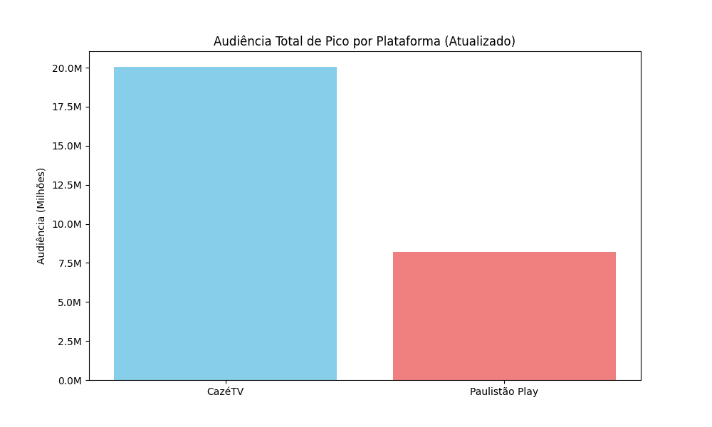

 📊 Sports Audience Pipeline: Automação e Insights LiveMode
 

Este projeto simula um pipeline de dados (ETL) para análise de audiência em transmissões esportivas digitais.
O objetivo é transformar dados brutos de plataformas como CazéTV e Paulistão Play em relatórios estratégicos para tomada de decisão.

 🚀 O que este projeto faz?
1. **Extração (Extract):** Lê dados de audiência em tempo real a partir de um arquivo `audiencia.csv`.
2. **Transformação (Transform):** Utiliza a biblioteca **Pandas** para tratar datas, agrupar picos de audiência por plataforma e identificar os jogos recordistas.
3. **Visualização:** Gera automaticamente um gráfico de barras com **Matplotlib**, formatado para escalas de milhões (M) para facilitar a leitura executiva.
4. **Carga (Load):** Exporta um relatório detalhado em **Excel** (`.xlsx`) com múltiplas abas e inicia um fluxo de automação de e-mail para o time de projetos.

## 🛠️ Tecnologias Utilizadas
- **Python 3.10+**
- **Pandas**: Manipulação e análise de dados.
- **Matplotlib**: Visualização de dados técnica.
- **Openpyxl**: Motor para geração de arquivos Excel.
- **Webbrowser & Urllib**: Automação de interface para comunicação (E-mail).

## 📈 Visualização Gerada

> *Exemplo de gráfico gerado automaticamente pelo script com dados atualizados de 9 jogos.*

## 🧠 Insights de Negócio
### 📈 Atualização Recente: Dados Reais e Automação (Fev/2026)

O projeto foi evoluído para incluir um pipeline de dados verídicos, trazendo mais fidelidade às análises de audiência:
- **Novos Dados:** Substituição de dados fictícios por recordes reais de 2024, como o pico de 4.1M na CazéTV (Corinthians x SP).
- **Scripts de Setup:** Criação do `setup_dados.py` para garantir a geração padronizada do dataset CSV.
- **Automação de Output:** O motor de análise agora gera automaticamente relatórios em Excel, gráficos de performance e rascunhos de e-mail executivos baseados nesses novos números.
